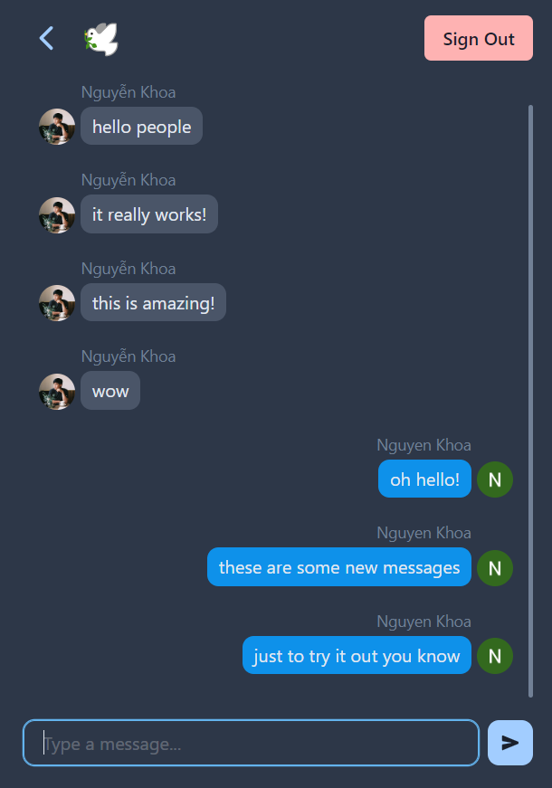

# Realtime Chat Application with React.js and Firebase

---

A small [chat app](https://hkhoa-ng.github.io/react-realtime-chat/) built using [React.js](https://reactjs.org) and [Firebase's Cloud Firestore](https://firebase.google.com/docs/firestore/), following [Fireship's tutorial](https://www.youtube.com/watch?v=zQyrwxMPm88&t=294s) but adding my own chat room function.

These are the main UI screen of the app.

 |  | 

A user can sign in with their Google account, and will be displayed in the chat rooms with their Google's profile picture and profile name. There is an option to sign out, and a back button in the chat room to go back to the room selection screen. If you share the room ID with your friends, you can have your own, private chat room! This is the key difference between my app and Fireship's.

The app used `Firebase's Cloud Firestore` to store and update data in real-time. `React` will re-render the chat messages element everytime there is a change in the message collection. Similar to how modern real-time chat apps work.

Since the project is relatively small, I kept everything in the `App.js` [file](./src/App.js), including every components and functions. Because of this, I don't have to worry about much complecation in global state management and props drilling.

Overall, this was a fun experience to try something new, while learning about different Firebase's functionalities.
